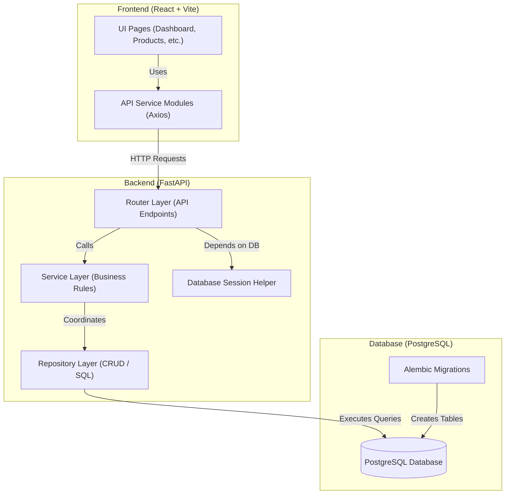

# Inventory & Order Management System

A production-ready Inventory and Order Management System built with a **FastAPI** backend, **React + Vite** frontend, and **PostgreSQL** database. Engineered following clean architectural separation of concerns, repository design patterns, database transaction safety controls, and multi-stage container deployments.

---

## Architecture Overview



### Folder Structures

```text
├── backend/
│   ├── app/
│   │   ├── config.py         # App configuration & environments
│   │   ├── database.py       # DB connection session maker
│   │   ├── main.py           # FastAPI app configurations
│   │   ├── models/           # SQLAlchemy ORM declarations
│   │   ├── schemas/          # Pydantic data schemas
│   │   ├── repositories/     # Database queries isolation
│   │   ├── services/         # Transaction & inventory business rules
│   │   ├── routers/          # Endpoint path mappings
│   │   └── utils/            # Consistent JSON error handlers
│   └── alembic/              # Database migration records
└── frontend/
    ├── src/
    │   ├── api/              # Axios unified request modules
    │   ├── components/       # Skeletons, Modals, Badges, DataTables
    │   ├── context/          # Toast Alert configurations
    │   ├── layouts/          # Responsive navigation sidebar
    │   ├── pages/            # Dashboard, Products, Customers, Orders
    │   └── routes/           # React Router mappings
```

---

## Live Demo & Screenshots

### Live Demo Links
* **Frontend Dashboard (Vercel):** [https://inventory-order-mgmt.vercel.app](https://inventory-order-mgmt.vercel.app) *(Placeholder)*
* **Backend API Documentation (Render):** [https://inventory-mgmt-backend.onrender.com/docs](https://inventory-management-backend-50ah.onrender.com) *(Placeholder)*

### Screenshots
*(Screencasts and layout screenshots demonstrating full responsiveness)*
* **Desktop Admin Dashboard**
  
* **Mobile Responsive View (320px)**
  
* **Orders Shopping Cart Panel**
  

---

## Database Design & Entity Relationships

The schema consists of 4 main tables: **Customer**, **Product**, **Order**, and **OrderItem** using UUID primary keys, Decimal price formats, and timestamps.

For a detailed constraint list and visual schema flowchart, refer to the [ER Diagram Document](file:///C:/Users/abhis/.gemini/antigravity-ide/brain/cbd8c81e-6e1b-4119-8895-9929a47fb9d5/er_diagram.md).

---

## Getting Started

### Local Setup (Without Docker)

#### 1. Backend Configuration
1. Navigate to the backend directory:
   ```bash
   cd backend
   ```
2. Create and configure your `.env` file:
   ```bash
   cp .env.example .env
   # Update variables including DATABASE_URL pointing to a running PostgreSQL
   ```
3. Initialize python virtual environment:
   ```bash
   python -m venv venv
   source venv/bin/activate  # On Windows: .\venv\Scripts\activate
   ```
4. Install pip requirements:
   ```bash
   pip install -r requirements.txt
   ```
5. Apply Alembic database migrations:
   ```bash
   alembic upgrade head
   ```
6. Run the FastAPI dev server:
   ```bash
   uvicorn app.main:app --host 0.0.0.0 --port 8000 --reload
   ```

#### 2. Frontend Configuration
1. Navigate to the frontend directory:
   ```bash
   cd ../frontend
   ```
2. Create and configure your `.env` file:
   ```bash
   cp .env.example .env
   # Update VITE_API_BASE_URL to point to http://localhost:8000/api/v1
   ```
3. Install npm packages:
   ```bash
   npm install
   ```
4. Run Vite development server:
   ```bash
   npm run dev
   ```

---

## Docker Compose Setup

Run the entire PostgreSQL, FastAPI, and Nginx-compiled Frontend stack using a single command.

1. Ensure Docker and Docker Compose are running.
2. In the project root, copy the example environment file:
   ```bash
   cp .env.example .env
   ```
3. Spin up all containers in build-detached mode:
   ```bash
   docker compose up --build -d
   ```
4. This starts three services:
   * **inventory_db (PostgreSQL 16):** Exposes port `5432` with volume mapping.
   * **inventory_backend (FastAPI):** Exposes port `8000` with self-urllib health check.
   * **inventory_frontend (Nginx):** Exposes port `5173` mapping compiled static assets.
5. Inspect container health:
   ```bash
   docker compose ps
   ```

---

## Deployment Instructions

### Backend (Render Deployment)
This repository is configured for Render via the [render.yaml](file:///d:/Projects/career-ops-main/Inventry-management-system/render.yaml) blueprint.
1. Connect this repository to your Render Account.
2. Render will automatically read `render.yaml` and provision a PostgreSQL database alongside your FastAPI web service.
3. The build script installs requirements, and the start command is configured to run `alembic upgrade head && uvicorn app.main:app --host 0.0.0.0 --port $PORT` which guarantees migrations apply before boot.

### Frontend (Vercel Deployment)
The React frontend includes [vercel.json](file:///d:/Projects/career-ops-main/Inventry-management-system/frontend/vercel.json) to handle SPA URL rewrites.
1. Connect the repository to your Vercel Account.
2. Select the `frontend` folder as the root directory.
3. Add the environment variable `VITE_API_BASE_URL` pointing to your deployed Render API (e.g. `https://your-api.onrender.com/api/v1`).
4. Vercel compiles the build and hosts your frontend assets, serving pages seamlessly.

---

## API Documentation Catalog

Open `/docs` (or `/redoc`) on your backend URL to view the interactive OpenAPI catalog.

### Critical Endpoints summary:
* **POST `/api/v1/orders/`**
  * Places a multi-item order. Enforces atomic transaction safety. If product quantities requested exceed available stock, the entire transaction is rolled back and returns `400 Bad Request`.
* **DELETE `/api/v1/orders/{id}`**
  * Soft cancels order. Sets status to `CANCELLED` and restores stock levels to products, keeping the order record for bookkeeping history.
* **DELETE `/api/v1/products/{id}` & DELETE `/api/v1/customers/{id}`**
  * Prevents deletion (returning `409 Conflict`) if the entities are referenced in active orders.
