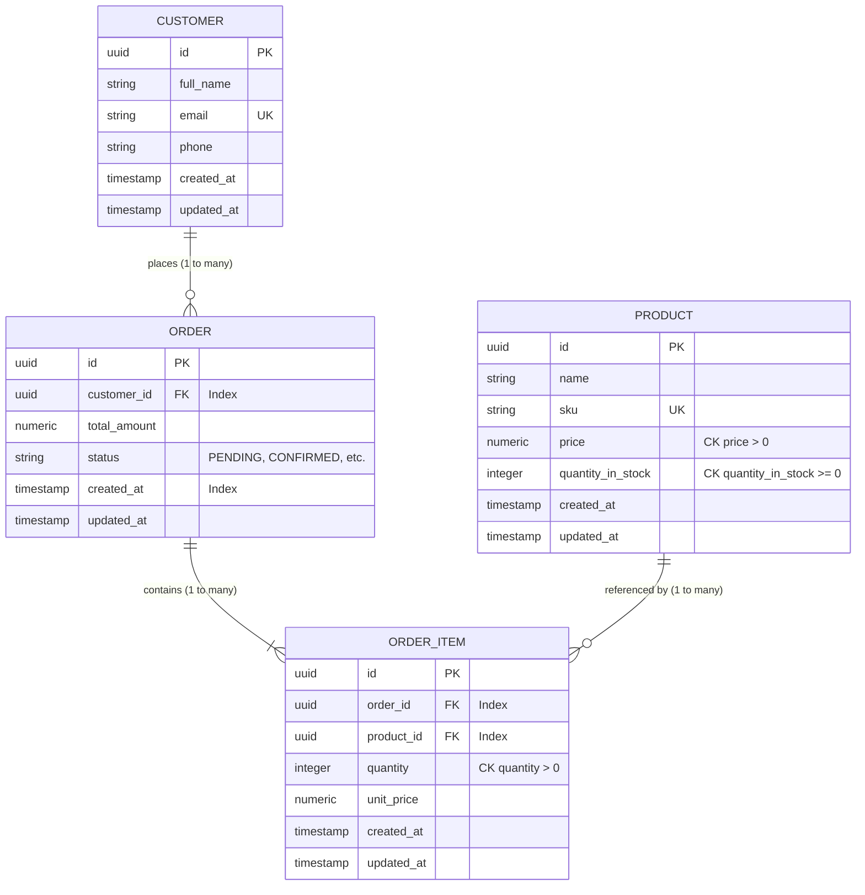

# Entity-Relationship (ER) Diagram

This document presents the entity-relationship schema for the Inventory & Order Management System. It details column mappings, database constraints, and referential integrity rules (cascades and restrictions) implemented in PostgreSQL.

---

## ER Diagram (Mermaid)

---

## Relationship Explanations & Referential Integrity

### 1. Customer to Order (One-to-Many)
* **Description:** A single `Customer` can place multiple `Order`s over time, but each `Order` belongs to exactly one `Customer`.
* **Database Mapping:** Represented by the `customer_id` foreign key on the `orders` table pointing to `customers.id`.
* **Cascading Rules:** Configured with `ondelete='CASCADE'`. If a Customer record is permanently deleted, all of their historical orders will be deleted automatically to maintain referential integrity.
* **Indexing:** `orders.customer_id` is indexed for fast lookups when querying a customer's order history.

### 2. Order to OrderItem (One-to-Many)
* **Description:** An `Order` aggregates one or more products, represented as individual line items (`OrderItem`). Each `OrderItem` is bound to exactly one parent `Order`.
* **Database Mapping:** Represented by the `order_id` foreign key on the `order_items` table pointing to `orders.id`.
* **Cascading Rules:** Configured with `ondelete='CASCADE'`. When an `Order` is deleted, its individual line items are also deleted automatically.
* **Indexing:** `order_items.order_id` is indexed to optimize fetching order details.

### 3. Product to OrderItem (One-to-Many)
* **Description:** A `Product` can appear in many different order items across different customer orders. Each `OrderItem` references exactly one `Product`.
* **Database Mapping:** Represented by the `product_id` foreign key on the `order_items` table pointing to `products.id`.
* **Cascading Rules:** Configured with `ondelete='RESTRICT'`. A product *cannot* be deleted if it is linked to any existing `OrderItem` record. This prevents orphan entries and secures financial history audits.
* **Indexing:** `order_items.product_id` is indexed to easily query which orders contain a specific product.
